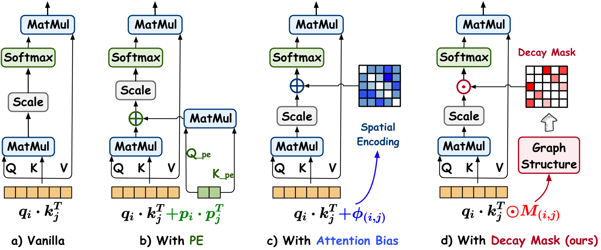

# Gradformer: Graph Transformer with Exponential Decay
Implementation for IJCAI'24 paper: Gradformer: Graph Transformer with Exponential Decay
## Overview



This paper presents **Gradformer**, a method innovatively integrating GT with the intrinsic inductive bias by applying an exponential decay mask to the attention matrix. Specifically, the values in the decay mask matrix diminish exponentially, correlating with the decreasing node proximities within the graph structure. This design enables Gradformer to retain its ability to capture information from distant nodes while focusing on the graph's local details. Furthermore, Gradformer introduces a learnable constraint into the decay mask, allowing different attention heads to learn distinct decay masks. Such an design diversifies the attention heads, enabling a more effective assimilation of diverse structural information within the graph.

### Python environment setup with Conda

```
conda create -n gradformer python=3.11
conda activate gradformer
conda install pytorch==2.1.0 torchvision==0.16.0 torchaudio==2.1.0 pytorch-cuda=11.8 -c pytorch -c nvidia
conda install pyg -c pyg
pip install rdkit-pypi cython
pip install ogb
pip install configargparse
pip install pyg_lib torch_scatter torch_sparse torch_cluster torch_spline_conv -f https://data.pyg.org/whl/torch-2.1.0+cu118.html

```

### Running Gradformer

```
conda activate gradformer
# Running Gradformer tuned hyperparameters for TuDataset.
sh ./scripts/run_nci1.sh 
# Running Gradformer tuned hyperparameters for ogbg-molhiv.
sh ./scripts/run_hiv.sh 
# Running Gradformer tuned hyperparameters for CLUSTER.
sh ./scripts/run_cluster.sh 
```

Supported datasets:

- TuDataset: `NCI1`, `PROTEINS`, `MUTAG`, `IMDB-BINARY`, `COLLAB`
- GNN Benchmarking: `ZINC`, `CLUSTER`, `PATTERN`
- OGB:  `ogbg-molhiv`

### Baselines

- GT:https://github.com/graphdeeplearning/graphtransformer
- SAN:https://github.com/DevinKreuzer/SAN                                               
- Graphormer:https://github.com/Microsoft/Graphormer    
- GraphTrans:https://github.com/ucbrise/graphtrans
- SAT:https://github.com/BorgwardtLab/SAT/tree/main
- EGT:https://github.com/shamim-hussain/egt_pytorch   
- GraphGPS:https://github.com/rampasek/GraphGPS/tree/main
- LGI-GT:https://github.com/shuoyinn/LGI-GT
- DeepGraph:https://github.com/zhao-ht/DeepGraph/tree/master

## Datasets

Datasets mentioned above will be downloaded automatically using PyG's API when running the code.

Gradformer is built using [PyG](https://www.pyg.org/) and [GraphGPS](https://github.com/rampasek/GraphGPS?tab=readme-ov-file#graphgps-general-powerful-scalable-graph-transformers). 
